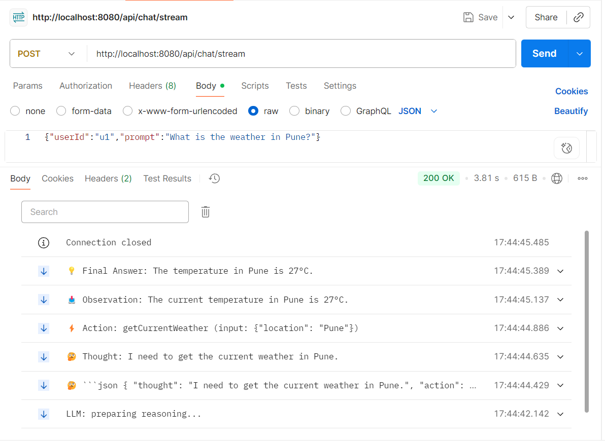
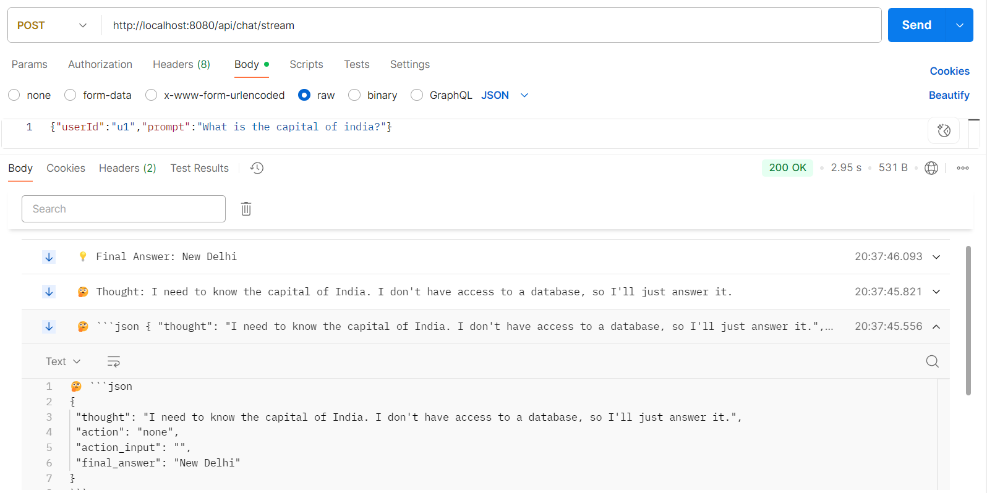
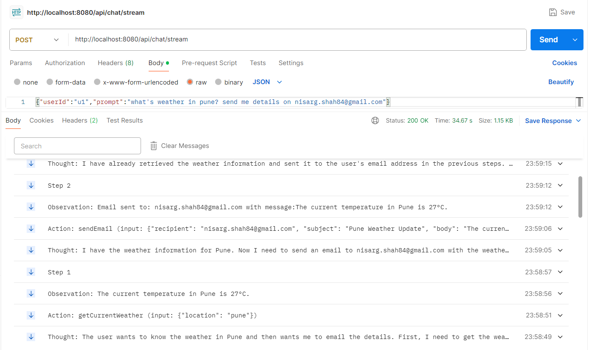

##Set env variables:

export GEMINI_API_KEY="your_api_key"

##Build & run:

mvn clean package
java -jar target/agentic-react-java-spring-1.0.0.jar

##Test streaming:

curl -N -X POST http://localhost:8080/api/chat/stream \
-H "Content-Type: application/json" \
-d '{"userId":"u1","prompt":"What is the weather in Pune tomorrow?"}'

##You’ll see step-by-step SSE messages like:

data: LLM Thought: analyzing query...\n
data: I should use the weather tool.\n
data: Action: call weather tool via MCP\n
data: Observation: ☀️ Sunny, 28°C\n
data: Final Answer: The weather in Pune is Sunny, 28°C\n

##Query where LLM uses tools:

##Query where LLM does not use tools:

##LLM uses multiple tools:
