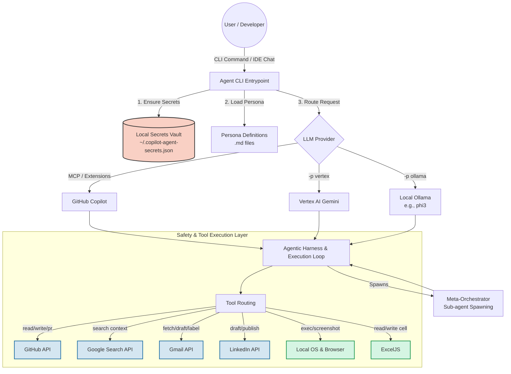

# Copilot Agent CLI (Node.js)

This module implements an Autonomous Agent CLI integrated with GitHub Copilot concepts. It allows you to run specialized AI "personas" that interact with the local file system, GitHub, Gmail, and Google Search to perform complex workflows.

## Architecture
- `cli/`: Entry point for the CLI tool built with Commander (`index.js`).
- `personas/`: Markdown definitions for various agents (e.g., `dev-agent.md`, `email-assistant.md`, `orchestrator-agent.md`).
- `tools/`: Extensible tools for the agents to use (`github.js`, `gmail.js`, `search.js`, `orchestrator.js`, `gemini.js`, `config.js`).
- `mcp_server/`: Reserved for exposing these tools via the Model Context Protocol (MCP).

---


### Full Architecture Diagram (Agentic Harness)



## 🚀 Setup & Initialization

### 1. Install Dependencies
```bash
cd GenAI_Repo/Copilot_Agent_CLI
npm install
```

### 2. Secret Management
The CLI requires various API keys depending on the persona being used. **You do not need to put them in `.env` files.** 
When you run a command for the first time, the CLI will securely prompt you for missing keys and store them in `~/.copilot-agent-secrets.json` (with restricted `0o600` permissions).
- **GitHub & Search**: Prompts for `GITHUB_TOKEN`, `GOOGLE_API_KEY`, `GOOGLE_SEARCH_ENGINE_ID`.
- **Gmail**: Prompts for `GMAIL_CLIENT_ID`, `GMAIL_CLIENT_SECRET`, `GMAIL_REFRESH_TOKEN`.
- **Vertex AI (Gemini)**: Prompts for `GCP_PROJECT_ID`. Ensure you have authenticated using `gcloud auth application-default login`.

### 3. Install & Setup Ollama Locally (Optional)
If you prefer to run models locally without relying on cloud providers, you can use Ollama.

**macOS / Linux:**
```bash
curl -fsSL https://ollama.com/install.sh | sh
```

**Windows:**
Download the installer from [ollama.com/download](https://ollama.com/download).

**Setup the Model:**
After installation, start the Ollama service (if it isn't already running) and pull a model (e.g., `llama3` or `phi3`):
```bash
ollama serve &
ollama run llama3
```

---

## 🤖 Supported Providers

The CLI supports **GitHub Copilot** (via MCP/Extensions), natively executing tasks using **Google Cloud Vertex AI (Gemini 1.5 Pro)**, and running fully locally with **Ollama** (e.g., `phi3`, `llama3`). 

To run an agent using Gemini Vertex AI, simply append the `-p vertex` or `--provider vertex` flag to your command. The CLI will load the persona as a system instruction and execute the task!

To run an agent using local Ollama, append `-p ollama` and optionally `-m <model_name>` (defaults to `phi3`). Ensure you have Ollama installed and the model pulled:
```bash
ollama run phi3
node cli/index.js -p ollama -m phi3 persona dev-agent "Add a feature to tools/search.js"
```


---

## 🎭 Available Personas & Scenarios

### 1. The Autonomous Development Engineer (`dev-agent`)
Behaves like a senior software engineer. It takes a requirement, understands the repo, plans changes, searches the web for documentation, implements code, writes tests, validates, and iterates until the requirement is satisfied.

**Scenario:** You need to add pagination to an existing API endpoint but don't want to write the boilerplate.

**Running the Example with Vertex AI (Gemini):**
1. Open your terminal in the CLI directory.
2. Run the agent natively using Gemini Vertex AI:
   ```bash
   node cli/index.js -p vertex implement "Add pagination to the commit listing API in tools/github.js"
   ```
3. Gemini will assume the `dev-agent` persona, read the repository context, plan the strategy, implement the code, and print the output step-by-step.

**Running the Example with Local Ollama:**
1. Ensure Ollama is running and you have pulled a model (e.g., `llama3` or `phi3`).
2. Run the CLI tool specifying the `ollama` provider and the model:
   ```bash
   node cli/index.js -p ollama -m llama3 implement "Add pagination to the commit listing API in tools/github.js"
   ```
3. The local model will execute the same persona-driven planning and implementation locally.

**Running the Example with GitHub Copilot Chat:**
1. Open GitHub Copilot Chat in your IDE (VS Code / IntelliJ).
2. Use the `@workspace` command to pass the persona context and instructions:
   > `@workspace Read the persona definition in Copilot_Agent_CLI/personas/dev-agent.md. Adopt this persona and add pagination to the commit listing API in tools/github.js.`
3. Copilot will review your repo files and the persona rules to generate a comprehensive fix directly in the chat window, ready for you to apply.

### 2. The Executive Email Assistant (`email-assistant`)
An autonomous assistant that manages your Gmail inbox. It reads unread emails, categorizes them, archives newsletters, and drafts replies to important messages. **It will never send an email without your explicit review.**

**Scenario:** You return from vacation and have 50 unread emails. You want the AI to organize them and draft replies to urgent client requests.
**Steps:**
1. Run the email assistant persona using Vertex AI:
   ```bash
   node cli/index.js -p vertex persona email-assistant "Please analyze my recent unread emails, organize them, and draft replies to anything urgent."
   ```
2. The CLI will prompt you for your Gmail OAuth credentials and `GCP_PROJECT_ID` if you haven't set them up.
3. The Gemini agent receives the `email-assistant` system instructions and outputs its action plan. (Note: Tool execution loops for Gemini require enabling Function Calling in `gemini.js`).

### 3. The Lead Agent Orchestrator (`orchestrator-agent`)
A meta-agent capable of decomposing massive tasks into smaller chunks. It dynamically designs specialized sub-agent personas (e.g., `db-expert`, `frontend-designer`), generates their `.md` files, and spawns them concurrently to solve the problem.

**Scenario:** You want to build a complete full-stack application from scratch, requiring different domains of expertise.
**Steps:**
1. Run the orchestrator with a high-level goal:
   ```bash
   node cli/index.js -p vertex persona orchestrator-agent "Build a full-stack login portal with a React frontend and a Node/Express backend."
   ```
2. Gemini acts as the meta-agent, analyzing the request and writing two new personas to the `personas/` folder: `react-expert.md` and `node-expert.md`.
3. It uses the `spawnSubAgent` tool to launch both agents in the background.
4. You will see prefixed logs in your terminal as the sub-agents work.
5. The orchestrator waits for them to finish, synthesizes their outputs, and presents the final unified application.

---


### 4. The Local System & Browser Operator (`system-operator`)
An autonomous agent capable of operating your local computer, interacting with the desktop file system (like Excel/Word), and controlling the browser (Chrome) using tools like Playwright or Puppeteer. It has built-in safety guardrails to prevent destructive commands.

**Scenario:** You want to automate opening a browser, searching for information on Wikipedia, extracting the text, and taking a screenshot of the page.
**Steps:**
1. Run the system-operator persona using Vertex AI:
   ```bash
   node cli/index.js -p vertex persona system-operator "Open Chrome, navigate to wikipedia.org, search for AI Agents, extract the summary, and take a screenshot."
   ```
2. The agent interprets the request, forms an execution plan, and calls the appropriate system tools (`browserOpen`, `runCommand`, `takeScreenshot`).
3. It performs safety checks before running any OS-level shell commands to prevent destructive actions (e.g., `rm -rf`).
4. Once completed, it reports back the extracted data and the location of the screenshot.


### 5. The LinkedIn Brand Manager (`linkedin-agent`)
An autonomous agent specialized in drafting professional LinkedIn posts based on user topics, engaging in an iterative feedback loop with the human, and publishing the final post via the LinkedIn API.

**Scenario:** You want to write a post about the latest release of a software tool, but you want to review and tweak the text before it goes live to your network.
**Steps:**
1. Run the linkedin-agent persona using Vertex AI:
   ```bash
   node cli/index.js -p vertex persona linkedin-agent "Draft a LinkedIn post about our new Copilot Agent CLI tool. It helps automate GitHub and local system workflows."
   ```
2. The CLI will securely prompt you for your `LINKEDIN_ACCESS_TOKEN` if not already set.
3. The agent will output a drafted post and explicitly ask you for feedback or approval.
4. If you ask it to reframe (e.g., "Make it punchier" or "Add more emojis"), it will revise the text.
5. Once you reply with "APPROVED", the agent will natively call the `publishLinkedInPost` tool to push it live to your LinkedIn feed.

## 🔧 How to use with GitHub Copilot

### 1. Copilot Chat Persona Prompting (Workspace Context)
You can directly instruct GitHub Copilot Chat in your IDE (VS Code, IntelliJ) to adopt any persona defined in this repository. 
Simply open Copilot Chat and type:
> `@workspace Read the persona definition in Copilot_Agent_CLI/personas/email-assistant.md and adopt this persona. Now, [insert your specific task here].`

Copilot will read the exact multi-step workflow, boundaries, and tool descriptions from the markdown file and execute its response following the strict plan.

### 2. GitHub Copilot Extensions / MCP (Model Context Protocol)
Because the tools and CLI are modularized in Node.js, they are primed to be exposed as an **MCP Server**. Once configured, GitHub Copilot can natively call `github.js`, `search.js`, `gmail.js`, and `orchestrator.js` directly from the chat interface. Copilot will invoke the tools, read the secrets safely from your local machine, and perform actions autonomously without you needing to run the CLI manually.

---

## 🛠️ Troubleshooting

### How to Reset Credentials Locally

If you need to reset your locally stored credentials (e.g., Gmail, GitHub, Vertex AI), they are stored in two different places depending on the type of secret.

#### 1. General Secrets (Gmail, GitHub, LinkedIn, etc.)
These secrets are prompted interactively and stored in a hidden JSON file in your user's home directory.

*   **Mac / Linux**: 
    ```bash
    # To delete all secrets and start fresh:
    rm ~/.copilot-agent-secrets.json
    
    # Or open it in an editor to only delete specific ones:
    nano ~/.copilot-agent-secrets.json
    ```
*   **Windows (Command Prompt)**:
    ```cmd
    :: To delete all secrets:
    del "%USERPROFILE%\.copilot-agent-secrets.json"
    
    :: Or open in Notepad to edit:
    notepad "%USERPROFILE%\.copilot-agent-secrets.json"
    ```

#### 2. Vertex AI Service Account Path
If you need to reset the absolute path to your GCP `.json` file, you must delete the config file generated by the OS:

*   **Mac**: 
    ```bash
    rm ~/Library/Preferences/copilot-agent-cli-nodejs/config.json
    ```
*   **Windows**: 
    ```cmd
    del "%APPDATA%\copilot-agent-cli-nodejs\config.json"
    ```
*   **Linux**: 
    ```bash
    rm ~/.config/copilot-agent-cli-nodejs/config.json
    ```

The next time you run the CLI, it will automatically prompt you to re-enter the missing credentials.
