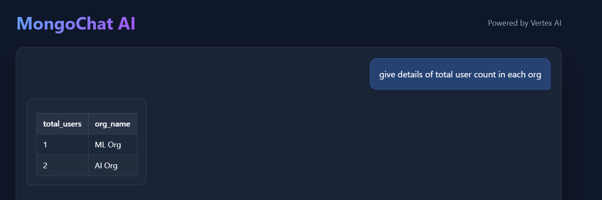
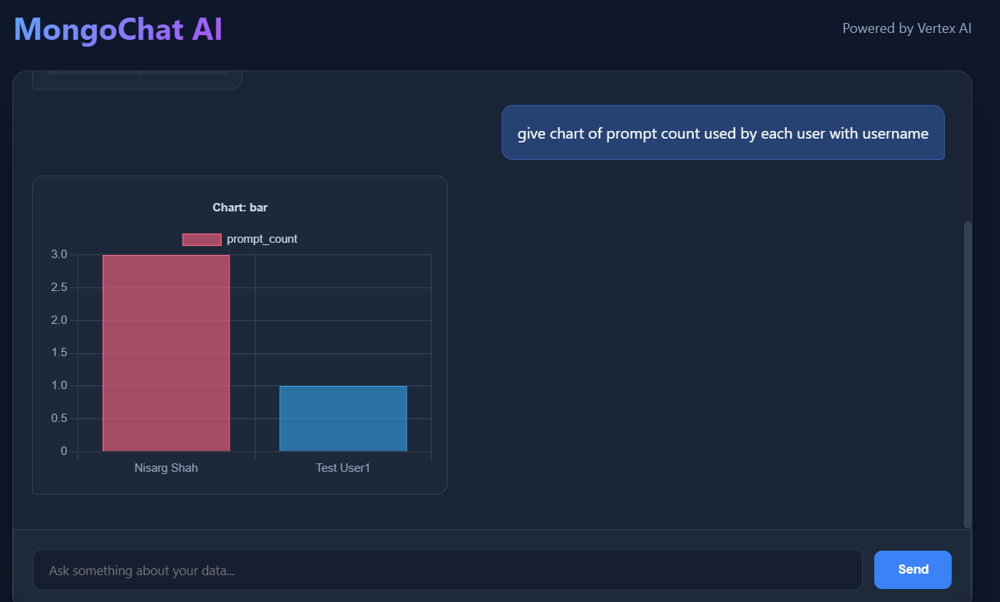
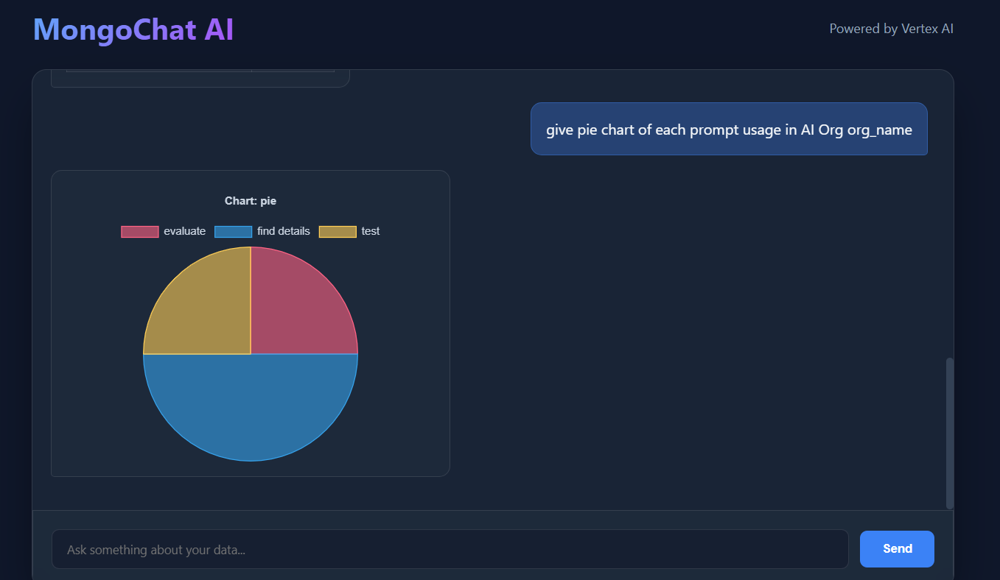

# Chat with MongoDB using Spring Boot + Vertex AI Gemini

## 1. Overview

This document describes a **step-by-step implementation plan** to build a **Spring Boot (Java) application** that allows users to **chat with MongoDB using natural language**, powered by **Vertex AI Gemini**, and display results as **text, tables, or charts** in an interactive UI.

---

## 2. High-Level Architecture

```text
[ Web UI (Chat) ]
        |
        v
[ Spring Boot Backend ]
   ├── Chat Controller
   ├── Schema Loader
   ├── Prompt Builder
   ├── Vertex AI Gemini Client
   ├── LLM Response Parser
   ├── Mongo Aggregation Executor
   ├── Result Interpreter
        |
        v
[ MongoDB ]
```

## 3. Technology Stack
### Backend
Java 21
Spring Boot 3.5.9
Spring Web
Spring Data MongoDB
Spring WebFlux (WebClient)
Jackson (JSON parsing)

LLM
Google Vertex AI – Gemini (text / json output)

### Frontend
React
Chart.js / ECharts / Recharts

## 4. Create Spring Boot Project
### 4.1 Dependencies

spring-boot-starter-web
spring-boot-starter-data-mongodb
spring-boot-starter-validation
spring-boot-starter-webflux
lombok

### 4.2 Package Structure
com.nisarg.chat
 ├── controller
 ├── service
 ├── llm
 ├── prompt
 ├── parser
 ├── mongo
 ├── schema
 ├── dto
 └── config

## 5. Interactive Chat UI
### 5.1 UI Features
Chat input box
Conversation history
Response rendering:
Text
Table
Chart

### 5.2 Chat API Contract
http
POST /api/chat
Request

```

{
  "sessionId": "abc123",
  "message": "Show total sales per city last month"
}
```
Response
```

{
  "type": "CHART",
  "data": {},
  "explanation": "Total sales grouped by city"
}
```

## 6.  MongoDB Schema & Relationship Management
### 6.1 Schema Definition (File-based)
Store schema metadata in JSON/YAML.

Example,
```
{
  "collection": "orders",
  "fields": {
    "orderId": "string",
    "amount": "number",
    "city": "string",
    "createdAt": "date",
    "customerId": "objectId"
  },
  "relationships": {
    "customerId": {
      "collection": "customers",
      "field": "_id"
    }
  }
}
```
### 6.2 Schema Loader Service
Responsibilities:
Load schema from files
Merge multiple collection schemas
Provide schema context to prompt builder

## 7. Prompt Construction
### 7.1 Prompt Objectives
Provide schema & relationships
Enforce valid MongoDB aggregation
Force strict JSON output

### 7.2 Prompt Template

```
You are a MongoDB aggregation expert.

Available collections and schemas:
{{SCHEMA_CONTEXT}}

Rules:
- Output ONLY valid JSON
- Do NOT include explanations outside JSON
- Use MongoDB aggregation pipeline syntax
- Do NOT use $out or $merge

User Query:
"{{USER_QUERY}}"

Output JSON format:
{
  "collection": "<collection_name>",
  "pipeline": [],
  "outputType": "TEXT | TABLE | CHART",
  "chart": {
    "type": "bar | line | pie",
    "x": "<field>",
    "y": "<field>"
  }
}
```

## 8. Vertex AI Gemini Integration
### 8.1 Authentication
Use Google Cloud Service Account

Set environment variable:

```
GOOGLE_APPLICATION_CREDENTIALS=/path/key.json
```

### 8.2 Gemini Client Design

```
public interface GeminiClient {
    GeminiResponse generateAggregation(String prompt);
}
```

### 8.3 Vertex AI Gemini REST Call 

## 9. Parse and Validate LLM Response
### 9.1 Parsing
Deserialize JSON using Jackson

Extract:
Collection name
Aggregation pipeline
Output type

### 9.2 Validation Rules
Allowed operators only ($match, $group, $lookup, $project)
Max pipeline length
Ensure target collection exists

## 10. Execute MongoDB Aggregation
### 10.1 Convert to Spring Aggregation

```
Aggregation aggregation = Aggregation.newAggregation(
    pipelineDocs.stream()
        .map(doc -> context -> doc)
        .toList()
);
```

### 10.2 Execution

```
List<Document> results =
    mongoTemplate.aggregate(
        aggregation,
        collectionName,
        Document.class
    ).getMappedResults();
```

## 11. Interpret Aggregation Results
### 11.1 Output Types
Type	Action
TEXT	Send data back to Gemini for summarization
TABLE	Convert documents to rows/columns
CHART	Build x/y series from fields

### 11.2 Example Chart Response

```
{
  "type": "CHART",
  "data": {
    "labels": ["Delhi", "Mumbai"],
    "values": [120000, 95000]
  }
}
```

## 12. Optional LLM Explanation
For user follow-up questions like:

“Explain this result”
Send aggregation output back to Gemini:

## 13. Step 10: API Response to UI
### 13.1 Unified Response DTO

```
{
  "type": "TEXT | TABLE | CHART",
  "data": {},
  "explanation": "Human-readable explanation"
}
```

### 13.2 UI Rendering Logic
```
if type == TEXT   → render text
if type == TABLE  → render table
if type == CHART  → render chart
```

## 14. Security & Guardrails

MongoDB
Read-only user
Block $out, $merge
Execution timeout
Pipeline size limit

LLM
Temperature = 0
JSON schema validation
Retry invalid outputs

## Running the Application

Backend (Spring Boot)
Open a terminal in the root directory `chat-app` and run:

```powershell
.\mvnw spring-boot:run
```

Ensure you have updated `src/main/resources/application.properties` with your Google Cloud Project ID and credentials file path.

Frontend (React)
Open a new terminal in the `frontend` directory and run:

```powershell
cd frontend
npm install
npm run dev
```

Note: If you encounter an execution policy error with `npm` in PowerShell, use:
```powershell
cmd /c "npm run dev"
```

Access the application at `http://localhost:5173`.






