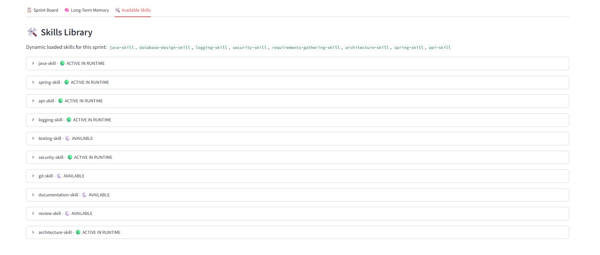
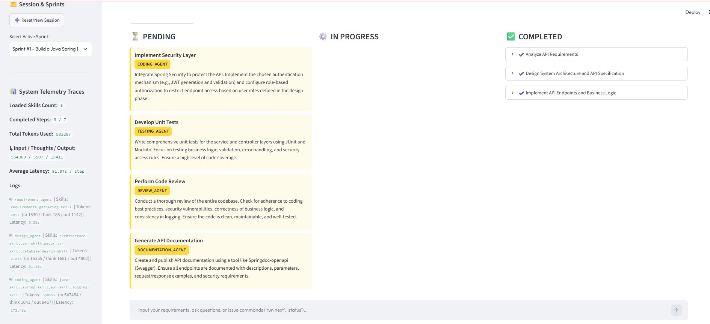
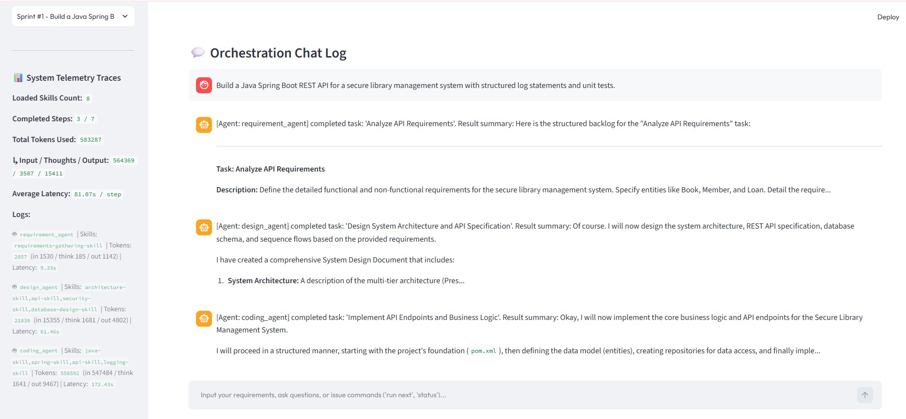

# SDLC Skills Multi-Agent System 🤖

A multi-agent system that runs an entire **Software Development Life Cycle (SDLC)** sprint — from requirement analysis to design, coding, testing, review, and documentation — using specialized [Google ADK](https://github.com/google/adk-python) agents backed by Gemini.

The core idea is **skills**: instead of stuffing every domain standard (Java, Spring, security, testing, …) into one giant prompt, each agent loads **only the skills the current task needs**. This keeps prompts small, cuts token usage, and lowers latency — while still enforcing the right standards for each task.

It offers two interfaces:
1. **Command Line Interface (`app.py`)**: A conversational CLI to drive a sprint from the terminal.
2. **Streamlit Dashboard (`ui/streamlit_app.py`)**: A visual dashboard to plan sprints, run tasks, review token/latency telemetry, and approve tool actions (human-in-the-loop).

---

## 🎯 Why Skills? (Prompt Size, Tokens & Latency)

Traditional agents ship a single, ever-growing system prompt that describes *every* rule the model might need. That prompt is re-sent on every call — you pay for those input tokens on **every** turn, and larger prompts mean higher latency.

This system takes a **skills-based, just-in-time** approach:

- **Small base prompts.** Each agent role (`requirement_agent`, `design_agent`, `coding_agent`, `testing_agent`, `review_agent`, `documentation_agent`) has a base prompt kept intentionally short (~under 150 words). See `BASE_PROMPTS` in [`workflow/executor.py`](workflow/executor.py).
- **Skills are modular and loaded on demand.** Each skill (e.g. `java-skill`, `spring-skill`, `security-skill`) is a self-contained [`google.adk.skills.Skill`](skills/) with its own `instructions`. The full catalog lives in [`skills/registry.py`](skills/registry.py).
- **Only relevant skills are injected.** During planning, the Coordinator assigns each task the exact `skills_needed`; keyword detection ([`skills/loader.py`](skills/loader.py)) maps requirement text to skills. At execution time the Executor appends **only those skills'** instructions to the base prompt — nothing more.

```
Final prompt  =  short base role prompt  +  ONLY the skills this task needs
              (not: base prompt + all 10 skills, every time)
```

**The result:**
- 🔽 **Smaller prompts** — a coding task loads `java-skill` + `spring-skill`, not documentation/security/git standards it will never use.
- 🪙 **Fewer input tokens per call** — you don't repeatedly pay for irrelevant standards.
- ⚡ **Lower latency** — smaller inputs return faster.
- 🎯 **Higher precision** — the model isn't distracted by rules unrelated to the task.

### Built-in telemetry

Every task execution records **real Gemini token usage** (input, thoughts, output, total) and **wall-clock latency** so you can measure the savings directly. Metrics are persisted per-task in the database and logged, e.g.:

```
[TELEMETRY] Agent: coding_agent | Skill size: 2 | Prompt size: 118 words |
Input tokens: 1423 | Thoughts tokens: 210 | Output tokens: 980 |
Total tokens: 2613 | Latency: 7.42s
```

See `execute_task` in [`workflow/executor.py`](workflow/executor.py) and `TokenUsage` in [`workflow/adk_runner.py`](workflow/adk_runner.py). The Streamlit dashboard surfaces these numbers per task.

---

## 🚀 Features

- **Coordinator / Planner / Executor pipeline:** The [`Coordinator`](agents/coordinator.py) turns a plain-English requirement into a structured **sprint plan** (`Planner`), then runs tasks sequentially (`Executor`), passing each task the outputs of previous steps as context.
- **Six specialist agents:** Requirement (BA), Design (Architect), Coding (Senior Dev), Testing (QA), Review (Principal Reviewer), and Documentation (Tech Writer).
- **10 pluggable skills:** `java`, `spring`, `api`, `logging`, `testing`, `security`, `git`, `documentation`, `review`, `architecture` — loaded dynamically per task.
- **Model tiering:** Reasoning-heavy roles (coding, design, planning) use `gemini-2.5-pro`; the rest use `gemini-2.5-flash` for speed and cost.
- **Real tools:** filesystem, git, code search, shell, and Jira tools ([`tools/`](tools/)) that agents can call to actually read/write code and run commands.
- **Human-in-the-loop approvals:** Side-effecting tool calls (file writes, commits, shell) can require explicit approval before running ([`tools/approval.py`](tools/approval.py)), reviewed from the dashboard.
- **Persistent memory:** Short-term chat, long-term decisions/feedback, automatic summarization + pruning, and lightweight semantic recall ([`memory/`](memory/)).
- **Durable sessions:** Sprints, tasks, memory, and ADK session IDs are persisted (SQLite by default) so work survives restarts.

## 🛠️ Tech Stack

- **Language:** Python 3.10+
- **Agent Framework:** Google ADK (`google-adk`)
- **LLM:** Gemini 2.5 Pro / Flash via **Vertex AI** (or Gemini API key fallback)
- **UI:** Streamlit
- **Persistence:** SQLAlchemy + SQLite (`skillforge.db`)
- **Testing:** pytest

## 🧭 Architecture

```
User requirement
      │
      ▼
┌─────────────┐     generates      ┌──────────────┐
│ Coordinator │ ─────────────────▶ │ Sprint Plan  │  (sequential tasks,
│  (chat/CLI) │                    │  (Planner)   │   each: agent + skills)
└─────────────┘                    └──────┬───────┘
      │  run next                          │
      ▼                                    ▼
┌─────────────┐   base prompt +     ┌──────────────┐   tools    ┌──────────┐
│  Executor   │   ONLY needed  ───▶ │  ADK Agent   │ ─────────▶ │  Tools   │
│             │   skills            │  (Gemini)    │            │ fs/git/… │
└──────┬──────┘                     └──────┬───────┘            └────┬─────┘
       │ token + latency telemetry         │ output                  │ approval
       ▼                                    ▼                         ▼
   Database  ◀──── memory / decisions ──── Memory Manager      Human-in-the-loop
```

## 📸 Screenshots

| | |
| --- | --- |
|  |  |
|  |  |
|  |  |

---

## 📦 End-to-End Setup Guide

### 1. Prerequisites

- **Python 3.10 or higher** installed.
- Access to **Gemini**, via either:
  - **Vertex AI (default):** a Google Cloud project with the *Vertex AI API* enabled and a **service-account key JSON** with Vertex AI access, **or**
  - **Gemini API key (fallback):** a key from [Google AI Studio](https://aistudio.google.com/).

### 2. Clone the Repository

```bash
git clone https://github.com/NisargShah1/GenAI_Repo.git
cd GenAI_Repo/sdlc-skills-multi-agent-system
```

### 3. Create a Virtual Environment (Recommended)

**Mac/Linux:**
```bash
python3 -m venv venv
source venv/bin/activate
```

**Windows:**
```bash
python -m venv venv
venv\Scripts\activate
```

### 4. Install Dependencies

> Note: the requirements file is named `requirement.txt` (singular).

```bash
pip install -r requirement.txt
```

### 5. Configure Environment Variables

Copy the example file and fill in your values:

```bash
cp .env.example .env
```

**Option A — Vertex AI (default):**
```dotenv
GOOGLE_GENAI_USE_VERTEXAI=true
GOOGLE_CLOUD_PROJECT=your_gcp_project_id
GOOGLE_CLOUD_LOCATION=us-central1
GOOGLE_APPLICATION_CREDENTIALS=/absolute/path/to/service-account-key.json
DATABASE_URL=sqlite:///skillforge.db
```

**Option B — Gemini API key (fallback):**
```dotenv
GOOGLE_GENAI_USE_VERTEXAI=false
GEMINI_API_KEY=your_gemini_api_key_here
DATABASE_URL=sqlite:///skillforge.db
```

> `.env` and `*.db` are git-ignored — never commit your credentials.

### 6. Run the Application

**Streamlit dashboard (recommended):**
```bash
streamlit run ui/streamlit_app.py
```
Then open the URL Streamlit prints (usually `http://localhost:8501`).

**Command Line Interface:**
```bash
python app.py
```

### 7. Use It

1. Enter a plain-English requirement (e.g. *"Build a Spring Boot REST API for user management with JWT security and JUnit tests"*).
2. The Coordinator generates a **sprint plan** — sequential tasks, each with an assigned agent and the skills it will load.
3. Send **`run next`** (CLI) or click the execute button (dashboard) to run tasks one at a time.
4. Approve any pending tool actions (file writes, commits) from the dashboard.
5. Watch per-task **token usage and latency** to see the effect of skill-scoped prompts.

CLI commands: `run next` · `status` · `reset` · `exit`

### 8. Run the Tests

```bash
pytest
```

---

## 📂 Project Structure

```
sdlc-skills-multi-agent-system/
├── app.py                  # CLI entry point
├── config.py               # Model + Vertex AI / API-key configuration
├── agents/coordinator.py   # Orchestrates planning + execution
├── workflow/
│   ├── planner.py          # Requirement → structured SprintPlan
│   ├── executor.py         # Base prompts + skill injection + telemetry
│   └── adk_runner.py       # ADK Runner + token-usage capture
├── skills/                 # 10 modular skills + registry + keyword loader
├── tools/                  # filesystem, git, search, shell, jira, approval
├── memory/                 # short/long-term + summarization + vector recall
├── session/               # SQLAlchemy models + session/state management
├── ui/streamlit_app.py     # Streamlit dashboard
├── tests/                  # pytest suite
└── requirement.txt         # Python dependencies
```
